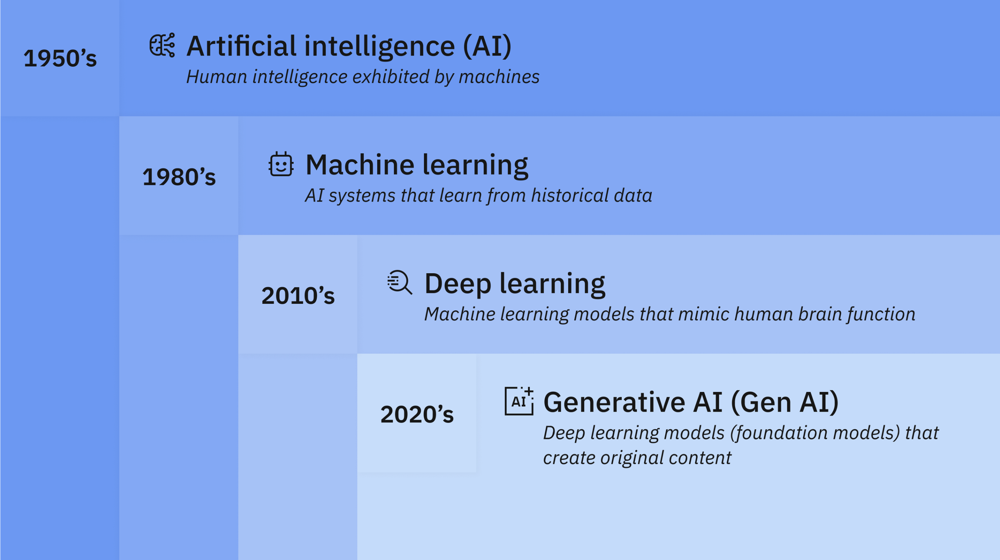

```{r setup, include=FALSE}
knitr::opts_chunk$set(echo = TRUE)
library(knitr)
```
\newpage
# Introduction 

« Les machines peuvent-elles penser ? »
C’est une question que s’est posée Alan Turing, souvent considéré comme le père de l’informatique et célèbre pour avoir déchiffré le code allemand ENIGMA durant la Seconde Guerre mondiale.
Aujourd’hui, l’informatique est présent partout et facilite l’exécution de tâches plus ou moins complexes. Mais au-delà de cela, l’intelligence artificielle (IA) a fait son apparition au cours de la dernière décennie, et désormais, de nombreux utilisateurs interagissent avec ces intelligences artificielles génératives.
Cela dépasse la simple exécution d’un code : l’IA permet de transformer nos volontés humaines en réponses informatiques, ce qui était auparavant impossible pour les personnes non initiées au langage informatique.
La capacité de ces modèles à comprendre et interpréter les intentions humaines fait toute la différence entre un programme informatique classique et une intelligence artificielle.

Mais alors, en quoi un programme informatique « classique » diffère-t-il d’une intelligence artificielle ?

Nous verrons d’abord quelles sont les principales caractéristiques d’un programme informatique traditionnel. Nous chercherons ensuite à comprendre, de manière vulgarisée, comment fonctionne une IA et comment celle-ci « naît ». Enfin, nous proposerons un rapide comparatif de leurs caractéristiques propres, avant d’évoquer les limites de chacun.

# Le programme informatique « classique » 

Un programme informatique classique repose sur une série d’instructions précises que la machine doit exécuter dans un ordre défini pour accomplir une tâche spécifique. Autrement dit, il suit un algorithme, c’est-à-dire une suite logique d’étapes menant à la résolution d’un problème. [@oru_en_2019]

## Vulgarisation de son cheminement 
Prenons l’exemple d’un robot à qui l’on demande de se déplacer pour récupérer un objet à l’autre bout d’une pièce. Le programme indiquera au robot chaque action à effectuer : avancer de tant de mètres, tourner, saisir l’objet, puis revenir.
Ce modèle fonctionne parfaitement tant que l’environnement reste conforme à ce qui était prévu. En revanche, s’il surgit un obstacle inattendu sur la trajectoire, le robot ne saura pas quoi faire à moins qu’on ait explicitement prévu ce cas dans le code. [@oru_en_2019]

## Les caractéristiques principales du programme « classique » 
C’est là la limite d’un programme classique : il est dépourvu de capacité d’improvisation ou d’adaptation. Toute décision dépend du programmeur, qui doit anticiper l’ensemble des situations possibles. Le programme ne comprend pas le sens de sa tâche, il exécute mécaniquement les instructions, sans interpréter le contexte.
En résumé, un programme informatique classique est déterministe, prévisible et rigide : il fait exactement ce pour quoi il a été conçu, ni plus, ni moins. [@oru_en_2019]

# L’Intelligence Artificielle 

Par définition l’intelligence artificielle correspond a tout outil utilisé par une machine capable de "reproduire des comportements liés aux humains, tels que le raisonnement, la planification et la créativité". [@ministere_de_lenseignement_superieur_de_la_recherche_et_de_lespace_intelligence_2025]

## Vulgarisation de son fonctionnement 

Contrairement à un programme informatique classique, l’intelligence artificielle (IA) peut s’affranchir de certaines limites liées à l’exécution stricte d’instructions. En effet, au lieu de lui dire quoi faire face à un obstacle, on lui apprend comment apprendre à réagir.
Ainsi, si notre robot rencontre un obstacle sur sa trajectoire, il peut analyser la situation, en tirer des conclusions, et ajuster son comportement sans qu’on ait prévu à l’avance chaque cas. L’IA ne se contente donc pas d’exécuter un plan, elle apprend et s’adapte.[@oru_en_2019]

Pour mieux comprendre, on peut distinguer deux grandes approches utilisées dans le fonctionnement de l’IA :

  **1. La logique formelle (le raisonnement)**

Dans cette méthode, on fournit à l’IA des informations comme la position de la table, celle des obstacles, et un ensemble de règles logiques (par exemple, “on ne peut pas traverser un obstacle”). L’IA doit alors calculer le meilleur chemin pour atteindre son objectif.

Ce système fonctionne tant que toutes les variables sont connues. Cependant, si un nouvel élément apparaît (un objet dont l’IA n’a pas connaissance) elle peut se retrouver incapable de gérer la situation seulement avec la logique formelle. [@oru_en_2019]

  **2. Les statistiques (l’apprentissage).**

L’autre méthode repose sur l’apprentissage à partir de données. On entraîne l’IA en lui montrant de nombreux exemples d’obstacles (boîte, rocher, tache d’huile, mur, etc.). Grâce à cette base, elle apprend à reconnaître par elle-même ce qui constitue un obstacle et à adapter sa trajectoire en conséquence. [@oru_en_2019]

En combinant apprentissage statistique et logique formelle, le robot pourra non seulement calculer le meilleur chemin, mais aussi identifier et éviter les obstacles connus. La limite demeure toutefois la suivante : si le robot rencontre un objet qu’il n’a jamais vu auparavant, il risque de ne pas le reconnaître comme un obstacle. [@oru_en_2019]

En résumé, l’IA sait faire face à des situations floues, ambiguës ou complètement nouvelles, des cas où un programme classique serait vite dépassé. Cette souplesse vient du fait qu’elle apprend de l’expérience, plutôt que de simplement appliquer, sans réfléchir, une suite d’instructions figées. [@oru_en_2019]

## Les sous ensemble de l'Intelligence Artificielle

```{r logo, echo=FALSE, out.width = '75%', fig.align = "center", fig.cap="Liens entre intelligence artificielle, machine learning, apprentissage profond et IA générative. (Strycker, Kavlakoglu, 2024)"}

```

Nous pouvons voir sur la figure ci-dessus que l'IA regroupe un certain nombre de sous ensmbles dont le machine learnig qui lui même regroupe le deep learning pour arriver à l'IA générative que beaucoup de personne et entreprise utillise aujourd'hui.

### Machine Learning
Sous-ensemble de l'intelligence artificielle, le machine learning permet aux machines d'utiliser des données pour améliorer leurs performances sur une tâche spécifique. [@lgayhardt_deep_2025]

### Deep Learning
C'est une technique avancée du machine learning. À travers de nombreuses couches de neurones qui créent des liens entre une grande quantité de données, il peut prédire et interpréter différentes données. [@lgayhardt_deep_2025]

*Exemple : Filtre anti-spam* 

Prenons un réseau à trois couches de neurones :  

* La première couche récupère l'e-mail et détecte des données (mots, images, etc.).  

* La deuxième couche met en relation les données de cet e-mail avec des e-mails spam et leurs caractéristiques principales.  

* La dernière couche calcule la probabilité que l'e-mail soit un spam ; s'il est avéré, il est signalé.

[@fangfang_que_2021]

 

### L'Intelligence Artificielle générative

Aujourd’hui nous utilisons principalement l’IA générative, qui se caractérise par la capacité à créer un contenu original complexe (texte, image, vidéo, audio), et cela en réponse aux requêtes d’un utilisateur. Cela fait plusieurs années que ce modèle génératif est utilisé en statistiques pour analyser les données numériques. Et dans les dernières décennies, le modèle a évolué.[@strycker_quest-ce_2024]

Mais comment fonctionne réellement une IA générative ? Il y a plusieurs phases pour arriver à l’IA que nous utilisons aujourd’hui :

  * La phase d’entraînement

  * La phase de réglage

  * La phase de génération, d’évaluation et donc ensuite de nouveaux réglages.

Durant la phase d’entraînement, on transmet à l’IA d’énormes quantités de données, que ce soit textuelles, d’image ou de vidéos, qui sont sur Internet, et grâce à cela l’IA peut alors répondre à des prompts. Cela s’appelle un modèle de formation.
Cela est très onéreux et demande beaucoup de hardware. C’est pourquoi il existe des projets de modèles de fondation qui sont open source, comme Llama-2 de Meta. L’utilisation de projets comme celui-ci permet aux développeurs d’éviter ces étapes et les coûts qui y sont associés.

L’ajustement, lui, vient plutôt permettre à l’IA de s’améliorer dans ses réponses. Deux cas sont possibles :


* Soit l’IA a une sorte de « personnalité » définie et alors elle a une direction quant aux prompts ou questions qu’elle est susceptible de recevoir, et a alors un format de réponse qui est adapté à la demande.


* Soit l’IA vient faire un renforcement par l’apprentissage à partir de commentaires humains, et là, c’est grâce aux réponses des utilisateurs que l’IA intégrera quelle est la meilleure réponse à apporter en fonction du prompt initial. Cela se fait par des choix simples entre deux réponses, disant laquelle est la plus adaptée, etc.

Les mises à jour du modèle s’effectuent à ce jour environ tous les ans. Une méthode d’amélioration des performances est aussi basée sur l’extension du modèle de formation en utilisant des sources pertinentes externes à celles présentes dans ce dernier.

Pour aller plus loin, les chercheurs ont défini deux types d’IA : l’IA faible et l’IA forte. L’une est très ciblée à une tâche spécifique, comme les assistants vocaux présents sur nos appareils (Alexa, Siri), et l’autre a la capacité de comprendre, d’apprendre et d’appliquer des connaissances sur un large éventail de tâches à un niveau potentiellement supérieur à l’intelligence humaine. Mais ce niveau d’IA est encore théorique et aucun système n’a atteint ce niveau de sophistication (peut-être dans le futur). [@strycker_quest-ce_2024]

# Comparaison entre programmes classiques vs Intelligence Artificielle

Nous pouvons donc comparer les deux systèmes 
Les programmes « classiques » fonctionnent grâce à des instructions codées manuellement par un développeur, avec une exécution toujours déterministe : la même entrée donne toujours la même sortie exacte. En revanche, l'intelligence artificielle, elle, repose sur des réseaux neuronaux multicouches qui apprennent automatiquement partir de très grandes quantités de données. Sont avancement dans l’apprentissage, suite à d’éventuelles mise à jour, retournera une réponse potentiellement différente. 

Concernant la gestion des erreurs, les programmes exigent une syntaxe parfaite : une virgule ou un point-virgule manquant bloque complètement sont execution, cela montre une inflexibilité du programme classique mais une fiabilité certaine. À l'inverse, l'IA tolère le flou et comprend le sens même avec des fautes d'orthographe ou des formulations imprécises. Cependant cela peut entrainer des réponses tout aussi imprécises ainsi que des erreurs. 

## Force et limites des deux systèmes

*tableau 1 : résumé des forces et limites des deux systèmes*

| **Critère**              | **Forces**                              | **Limites**                              |
|--------------------------|-----------------------------------------|------------------------------------------|
| **Programme classique**  | Précision absolue, fiabilité garantie   | Ne comprend pas le contexte, rigide      |
|--------------------------|-----------------------------------------|------------------------------------------|
| **IA **             | Excelle sur tâches complexes naturelles | Peut halluciner, énorme besoin de données|

# Conclusion

En conclusion, les programmes informatiques classiques et l’intelligence artificielle reposent sur deux logiques presque opposées.

D’un côté, les programmes traditionnels sont stricts ils exigent une syntaxe impeccable et se comportent exactement comme prévu, ce qui garantit leur fiabilité.

De l’autre, les systèmes d’IA sont flexibles grâce au deep learning, ils peuvent gérer l’imperfection humaine, interpréter des données ambiguës et traiter des informations complexes comme le langage humain.

Ces deux approches ne s’excluent pas, au contraire elles se complètent. Les programmes apportent la précision et la reproductibilité, tandis que l’IA brille dans l’analyse de données riches, floues ou imprévisibles.

L’avenir réside sans doute dans des systèmes hybrides qui combinent la rigueur des programmes classiques avec la capacité d’adaptation de l’IA.

Cependant, cette évolution s’accompagne aussi de nouveaux défis. Les IA, alimentées par des volumes massifs de données, soulèvent des questions cruciales de protection de la vie privée et de souveraineté numérique. Leur fonctionnement nécessite également d’importantes ressources matérielles : centres de données énergivores, consommation d’eau pour le refroidissement, empreinte carbone liée à l'entraînement des modèles. Des éléments qui posent la question de leur compatibilité avec les objectifs climatiques, notamment ceux fixés par les Accords de Paris.

L’enjeu sera donc de développer des technologies puissantes mais responsables, capables de concilier innovation, respect des données et durabilité environnementale.


\newpage
# Bibliographie
